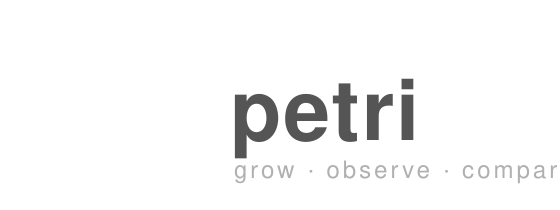

*petri* instruments a Python program, records its
variable state over time, saves each execution as a run, and tells you what
actually changed between two experiments.


Logo assets live in [`assets/`](assets/): `petri-mark.svg` (icon) and
`petri-logo.svg` (icon + wordmark lockup).

Single self-contained Python file, no dependencies, works with any Python 3.

## Install

```sh
curl -sL https://raw.githubusercontent.com/rohanhariharan/petri/main/petri \
  -o /usr/local/bin/petri
chmod +x /usr/local/bin/petri

# or, without sudo — drop it anywhere on your PATH
curl -sL https://raw.githubusercontent.com/rohanhariharan/petri/main/petri \
  -o ~/bin/petri && chmod +x ~/bin/petri
```

Or run the one-liner installer (defaults to `~/bin`, or `/usr/local/bin` under sudo):

```sh
curl -sL https://raw.githubusercontent.com/rohanhariharan/petri/main/install.sh | bash
```

Requires only a `python3` on your PATH.

## Usage

The language is the lab: you *grow* a culture, *plate* your dishes, *scope* a
sample, and run a differential *Gram test* to compare.

```sh
petri culture main.py          # grow a run, record variables
petri culture main.py --well baseline # grow a run into a named well
petri batch main.py --times 10 # grow N cultures (default 10)
petri plate                    # list all cultures
petri plate --well sweep       # list cultures in one well
petri scope 3                  # observe culture #3's variable history
petri gram 2 3                 # differential test (diff) two cultures
petri incubate main.py 500     # time a run against a 500 ms limit
petri sterilize                # delete all cultures (confirm twice)
```

Cultures can be grouped into named **wells** (a multiwell plate). Tag a single
run with `--well baseline`, or sweep a batch `petri batch sim.py --times 20
--well sweep`, then filter with `petri plate --well sweep` and diff any two of
them.

`petri incubate` runs the file as a real subprocess (no instrumentation) and
exits `0` if it finished within the limit (green), or `1` if it exceeded it
(red) — including if the program itself errored.

### Example

Given:

```python
x = 10
y = 5
z = x + y

x = 20
z = x + y
```

`petri` records:

```
x:    10 → 20
y:    5
z:    15 → 25
```

`petri gram 2 3` is the differential test — what changed between two cultures:

```
Gram stain of Culture #2 vs Culture #3

Gram-positive (changed)
────────────────────────
x
  10 → 20

z
  15 → 25
```

## What it records

Top-level variables (assignments) with basic Python values:

integers · floats · strings · booleans · lists · dictionaries · tuples · `None`

Each recorded change also carries a **millisecond timestamp** (elapsed since the
run started), shown by `petri scope`. Function locals, imports, and class bodies
are left untracked for now. Arbitrary objects are skipped rather than crash the
run.

## How it works

`petri` rewrites top-level assignments using Python's standard `ast` module,
wrapping each with a recorder call. The instrumented program runs as a real
**subprocess** (`python <program>`), so `os._exit()`, `quit()`, `if __name__ ==
"__main__"`, and `sys.argv` all behave exactly like a normal invocation. The
recorder appends each change to a JSONL log the instant it happens — so even a
hard `os._exit()` leaves the captured state on disk. Runs are saved under
`~/.petri/runs/` as JSON.

## Known limitations

- Top-level only — functions aren't instrumented yet.
- `petri incubate` times a run as a subprocess but doesn't instrument it.

## License

[MIT](LICENSE)
